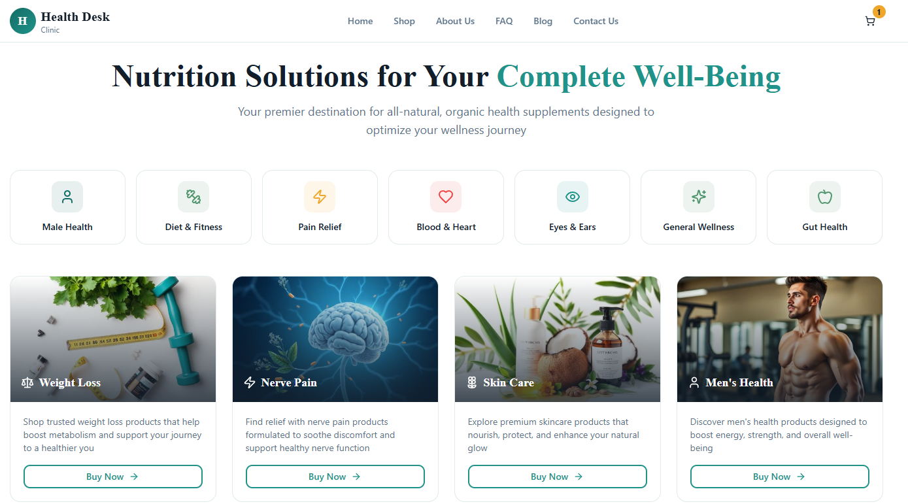
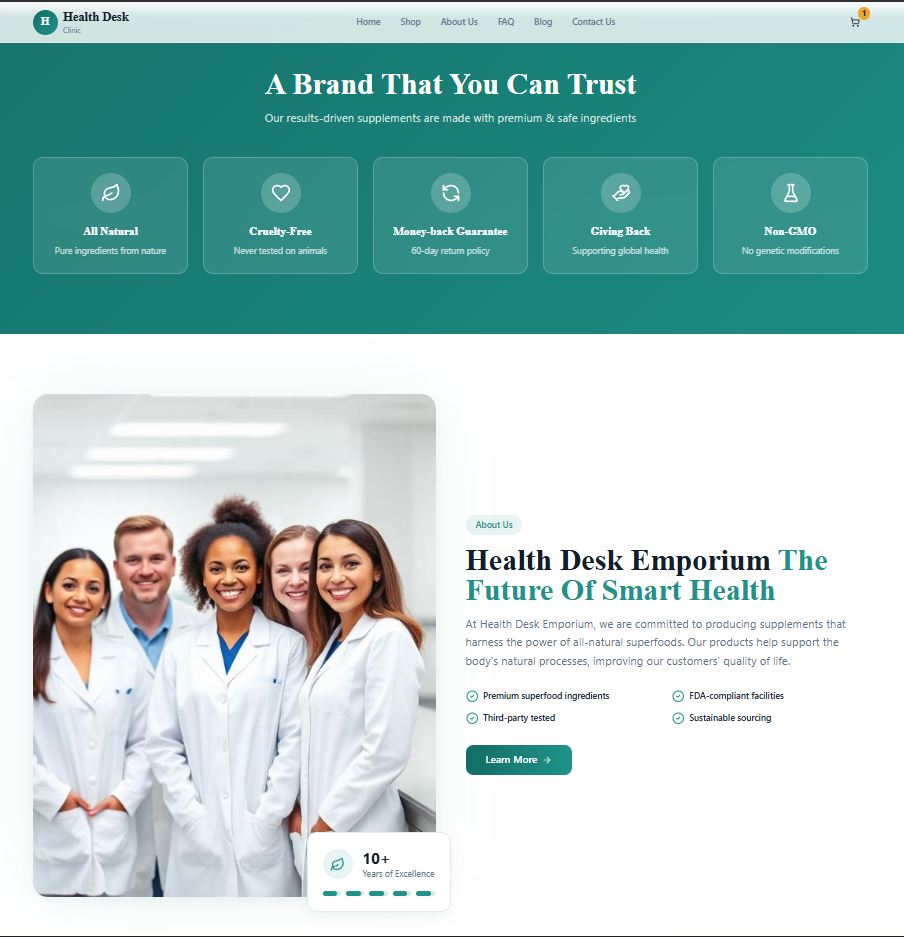
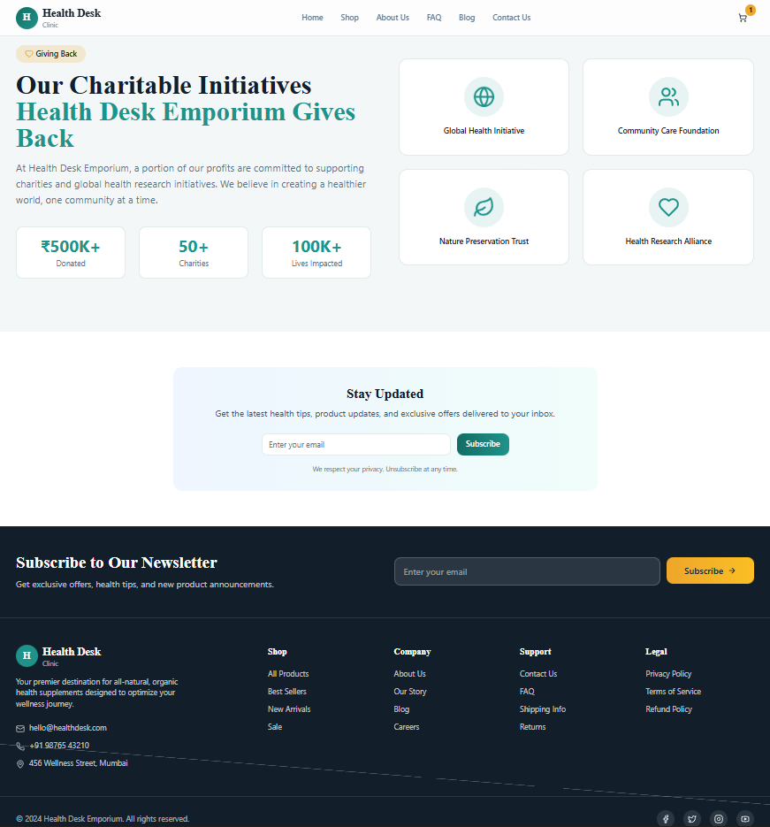
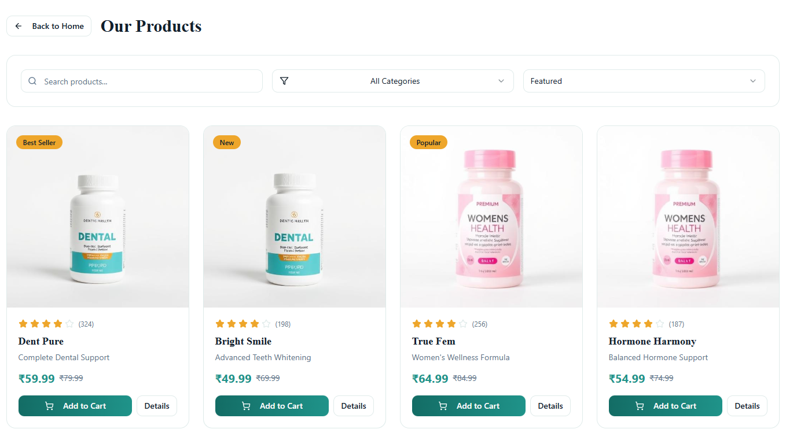
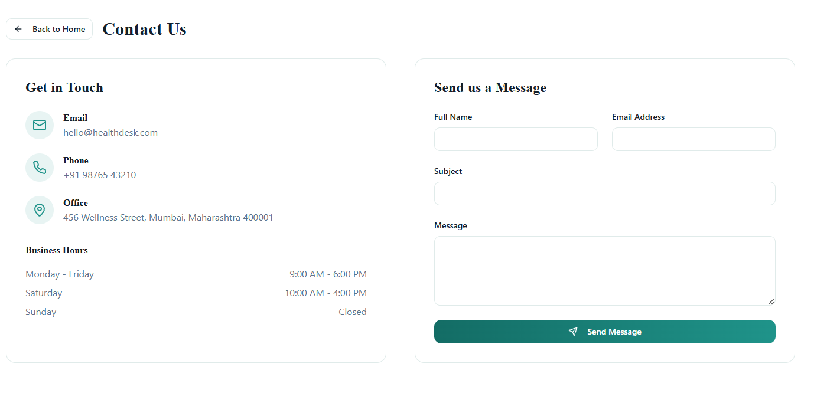

# 🏥 Health Desk & Wellness Store

A modern, responsive health & wellness storefront built from a Figma design.  
This project demonstrates frontend design implementation using **React**, **TypeScript**, **Tailwind CSS**, and **shadcn/ui**.

---

## 📸 Project Preview

---

# ⭐ Features

### 🛍️ Premium Product Catalogue  
Explore a curated selection of wellness products from trusted brands.  

---

### 🔍 Easy Navigation & Search  
Clean and intuitive UI for discovering products easily.  

---

### 📱 Fully Responsive Layout  
Optimized for desktop, tablet, and mobile screens.  

---

# 🚀 Getting Started

## ✔ Prerequisites
Ensure you have the following installed:

- **Node.js** (v16+)
- **npm** or **yarn**

---

## 📦 Installation

# Clone the repository
git clone https://github.com/vishal-kadalagi/Health-Desk-Wellness-Store.git

# Navigate into the project folder
cd Health-Desk-Wellness-Store

## ▶️ Local Development URL  
Your app will run at:  
👉 **http://localhost:5173**

---

# 🧰 Tech Stack

| Technology     | Purpose |
|----------------|---------|
| **Vite**       | Fast development & bundling |
| **React**      | Component-based UI architecture |
| **TypeScript** | Type-safe JavaScript |
| **Tailwind CSS** | Utility-first styling |
| **shadcn/ui**  | Pre-built accessible components |

---

# 🖼️ Screenshots

Below are all UI screens of the project (1 to 12):

### 1️⃣ Banner / Hero  

### 2️⃣ Product Showcase  

### 3️⃣ Search Section  

### 4️⃣ Mobile Responsive View  

### 5️⃣ Tech Stack Visualization  

### 6️⃣ Homepage  

### 7️⃣ Product Categories  

### 8️⃣ Featured Products  

### 9️⃣ Product Detail Page  

### 🔟 Shopping Cart  

### 1️⃣1️⃣ About Us Section  

### 1️⃣2️⃣ Newsletter Signup  

---

# 🛠️ Development Workflow

### Using Local IDE (VS Code Recommended)

1. **Clone the repo**
2. **Run**  
 
   npm install

# Install dependencies
npm install

# Start development server
npm run dev
